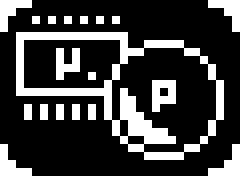

<div align = "center">

</div>

<h1 align = 'center'>Micro-Pong</h1> 

This project is developed as part of the **TTK4155** course: *Embedded and Industrial Computer Systems Design*.

## 📥 Installation

To get started, ensure you have a suitable development environment set up. You can use Microchip Studio on Windows or AVR Dudes for ATMEGA and OpenOCD along with ARM toolchain for Arduino on Linux.

**To download the project:**
```
git clone git@github.com:GHero0/TTK4155-micro-pong.git
```
For Atmel Studio users you will also need to add those files to your project so that they get compiled.

For Linux users please ensure that when you compile the project you do specify every present code file. 

## 📁 Project Structure 


```
.
├── arduino-due/
│   ├── src/
│   │   ├── drivers/
│   │   ├── main.c
│   │   └── ...
│   ├── include/
│   │   ├── drivers/
│   │   └── ...
│   └── tests/ 
│
├── atmega-162/
│   ├── src/
│   │   ├── drivers/
│   │   ├── main.c
│   │   └── ...
│   │
│   ├── include/    # Every *.h
│   │   ├── tests/  # Every test_*.h
│   │   ├── drivers/
│   │   ├── global.h
│   │   ├── globaldec.h # Global variables declaration
│   │   ├── constants.h # Constants declaration
│   │   └── ... 
│   └── tests/      # Every test_*.c 
│
├── docs/           # Documentation
│   ├── datasheets/ # Datasheets
│   └── ...
│
├── assets/         # Additional resources
│
├── .gitignore      # You shall not pass :)
└── README.md
```


## 🥸 Contributing & Git Workflow

<details>
<summary><strong>Small guide on contributing, click to expand</strong></summary>
<br>

We use a simple three-branch workflow:

- **main**: Contains stable, production-ready, and thoroughly tested code.
- **dev/main**: Used for ongoing development; code here may require further testing or cleanup.
- **dev/&lt;feature&gt;**: Dedicated branches for developing specific features.

**Why avoid direct commits to `main`?**  
Maintaining a stable `main` branch ensures you always have a reliable version to revert to when debugging or tracing issues.

**Why not work exclusively on `dev/main`?**  
While possible, working solely on `dev/main` can lead to conflicts if multiple contributors modify overlapping code. Feature branches help isolate changes and simplify collaboration.

**Check your current branch:**
```sh
git branch
```

**To create a new feature branch from `dev/main`:**
```sh
git checkout dev/main
git checkout -b dev/<feature-name>
```

**Workflow for making and committing changes:**

1. **Check for modifications since the last commit:**
    ```sh
    git status
    ```

2. **Stage files you want to commit:**
    ```sh
    git add <file-name>
    ```

3. *(Optional)* Verify staged files:
    ```sh
    git status
    ```

4. **Commit your changes with a meaningful message:**
    ```sh
    git commit -m "Descriptive message"
    ```

**Good commit message example:**  
`Improve memory latching and addressing; needs further testing`

**Poor commit message examples:**  
- "fix"
- "update"
- "stuff"

Clear commit messages help collaborators understand the purpose and context of your changes.

---

### Pushing and Pulling Changes

**To push your commits to the remote repository:**
```sh
git push origin <branch-name>
```
Replace `<branch-name>` with your current branch (e.g., `dev-feature1`).

**To pull the latest changes from the remote repository:**
```sh
git pull origin <branch-name>
```
This ensures your local branch is up to date with the remote branch.

</details>


## Authors

- **Felix** 
- **George**
- **Greg**
